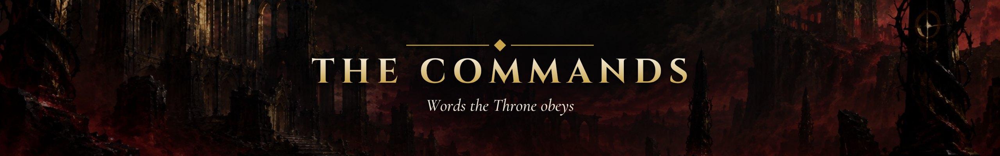

# ⌨️ The Commands

[🇧🇷 Português](./COMANDOS.md) · 🇺🇸 **English**

Everything you type to play, study and maintain the repository, on one page. Commands run in **Claude Code**, opened in this repository's folder. Forgot one mid-session? `/mestre ajuda`.

> The game is played in Portuguese, so the Master's commands stay in Portuguese; the explanations below are in English.

> **Contents:** [Typical session](#sessao-tipica) · [Master](#mestre) · [Study skills](#skills) · [Obsidian](#obsidian) · [Stuck?](#travou) · [Maintenance](#manutencao)

---

## 🔁 A typical session in 5 steps

1. **See the next mission:** `/mestre status` (or the ⚔️ box at the top of the [README](./README.md)).
2. **Study** the mission's resource and write the note in `notes/` (and the code in `exercises/`).
3. **Log the session** as one line in [`LOG.md`](./LOG.md): date, minutes, what you did, mission.
4. **Report to the Master:** `/mestre missão cumprida M0.1`. It checks the evidence and runs the **[oral exam](./ROADMAP.en.md#prova-oral)**: 2 short questions. Answer in your own words.
5. **Done:** the Master narrates the scene, adds the XP, ticks the mission and publishes everything with a commit on `main`.

---

## ⛓️ The Master

| Command | From | When to use | What happens | Example |
|---|:---:|---|---|---|
| `/mestre começar` | F0 | Once, on day one | The Master awakens, marks the game start in `LOG.md` and hands out the first goal | `/mestre começar` |
| `/mestre status` | F0 | Whenever you want your bearings | Short sheet, XP to the next level, streak and next goal | `/mestre status` |
| `/mestre ajuda` | F0 | Forgot a command | A short list of commands, with a link to this page | `/mestre ajuda` |
| `/mestre missão cumprida <ID>` | F0 | Finished a mission and the evidence is in the repo | Checks the evidence → oral exam → scene → XP, `[x]` and commit | `/mestre missão cumprida M1.3` |
| `/mestre missão cumprida <boss>` | F0 | Defeated the phase boss | Checks the [boss standard](./ROADMAP.en.md#padrao-de-chefao) → oral exam → **chapter** with a dilemma | `/mestre missão cumprida chefão F1` |
| `/mestre decisão <choice>` | F0 (after the boss) | After a chapter, to answer the dilemma | Narrates the consequence and records the choice in the chronicle | `/mestre decisão B` |
| `/mestre desafiar o chefão` | F1 | You already master the phase content (speedrun) | Faces the boss without the missions; winning grants the whole phase XP, losing costs nothing | `/mestre desafiar o chefão` |
| `/mestre posto avançado <what you did>` | F1 (networking) · F3 (career) | Did a networking action this month, or a career step | +15 XP (once a month) or the XP from the [outposts table](./ROADMAP.en.md#postos-avancados) | `/mestre posto avançado answered a question in the DataTalks Slack` |
| `/mestre side quest <what you did>` | F3 | Finished a [side quest](./ROADMAP.en.md#side-quests) | Taken on your word; narrates a short echo | `/mestre side quest Git in depth` |
| `/mestre santuário` | F0 | **Before** a planned break week (max. 4 a year) | The week does not count toward the goal and freezes the streak | `/mestre santuário next week, exams` |

The Master **never** does exercises or notes for you, and never takes XP away. Full rules in [How the game works](./ROADMAP.en.md#regras).

---

## 🎓 Study skills

| Command | From | When to use | What happens | Example |
|---|:---:|---|---|---|
| `/teach <topic>` | F0 | You did not get a concept, or were stuck 2+ sessions on a mission | Builds a short interactive lesson with a quiz in `classroom/lessons/` (+10 XP with the quiz done) | `/teach what a for loop is` |
| `/grilling <idea>` | F0 | You want to stress-test a plan (boss project, study routine) | A round of questions until the idea is clear, with a recommendation for each | `/grilling idea for the CS50P final project` |
| `/research <topic>` | F2 | You need to understand a topic in depth, from trusted sources | Researches primary sources and saves a Markdown summary | `/research DVC vs Git LFS` |
| `/diagnosing-bugs` | F1 | Your code breaks and you don't know why | An investigation routine: reproduce, isolate, test hypotheses | `/diagnosing-bugs my script raises KeyError` |
| `/tdd` | F1 (M1.7) | You are about to write code with tests | Guides the red → green → refactor loop with `pytest` | `/tdd function that sums expenses from a CSV` |
| `/code-review` | F1 (boss) | Before publishing a boss project | Reviews the code against the standards and what was asked | `/code-review since the first commit` |

These skills explain and ask questions; they don't solve the exercises for you either.

---

## 🕸️ Obsidian

After mission M1.6d. Open the command palette with `Ctrl+P` (`Cmd+P` on macOS) and type:

| Command | From | When to use | What happens | Example |
|---|:---:|---|---|---|
| *Spaced Repetition: Review flashcards…* | F1 (M1.6d) | Bad day, or a quick review | Reviews the flashcards in your notes; 15+ min count as a **minimum session** | Log it in `LOG.md` with 🟨 |
| *Obsidian Git: Commit-and-sync* | F1 (M1.6d) | Finished writing notes | Commits and pushes your notes to GitHub | — |
| *Templates: Insert template* | F1 (M1.6d) | A new study or concept note | Inserts the template from `templates/` into the open note | `conceito` or `nota-de-estudo` |

---

## 🆘 Stuck? Do this

- **I don't get the content** → `/teach <topic>`, or ask a [community](./ROADMAP.en.md#comunidades).
- **My code breaks** → `/diagnosing-bugs` with the error message.
- **Stuck for more than 2 sessions** → ask for help; it is part of the game ([rule 4](./ROADMAP.en.md#regras)).
- **Endless math** → a cap of 2 sessions per topic; move on and come back when it shows up in code ([rule 5](./ROADMAP.en.md#regras)).
- **Git complained about a conflict** (common with Obsidian Git) → `/resolving-merge-conflicts`.
- **I stopped studying for weeks** → just come back: `/mestre status`. The Master opens the [return ritual](./ROADMAP.en.md#santuario) and nothing is lost.
- **I found a key, password or personal data in the repo** → stop and read [SECURITY](./SECURITY.md) before any commit.

---

## 🔧 Maintenance

<b>Scripts, Git and other skills</b> — day to day, the Master runs all of this for you

| Command | From | When to use | What happens | Example |
|---|:---:|---|---|---|
| `python scripts/sync.py` | F0 | After editing `progress.yml` by hand | Updates badges, dashboards, the sheet and the Map of the Nine Circles | `python scripts/sync.py --check` only checks |
| `python scripts/qa.py` | F0 | Before committing doc changes | Checks links, PT/EN pairs, XP math, secrets and image metadata (CI runs the same) | `python scripts/qa.py` |
| `python scripts/clean_images.py` | F0 | Before committing any image | Strips GPS and camera data from images | `python scripts/clean_images.py --check` only checks |
| `git pull --rebase origin main` | F1 (M1.6b) | Before working in the terminal | Brings in commits from Obsidian Git and the Master | — |
| `git add` · `git commit -m "..."` · `git push` | F1 (M1.6b) | To publish what you did in the terminal | Records and sends your files to GitHub | `git commit -m "Notes for lecture 3"` |

The other skills in `.claude/skills/` (code design, domain modeling, prototypes, writing for agents) are for maintaining the repository and projects. The list and license are in [`THIRD-PARTY.md`](./.claude/skills/THIRD-PARTY.md).

