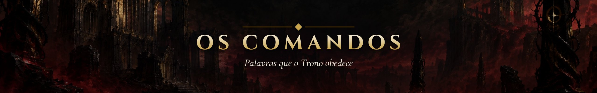

# ⌨️ Os Comandos

🇧🇷 **Português** · [🇺🇸 English](./COMANDOS.en.md)

Tudo o que você digita para jogar, estudar e manter o repositório, numa página. Os comandos rodam no **Claude Code**, aberto na pasta deste repositório. Esqueceu algo no meio da sessão? `/mestre ajuda`.

> **Índice:** [Sessão típica](#sessao-tipica) · [Mestre](#mestre) · [Skills de estudo](#skills) · [Obsidian](#obsidian) · [Travou?](#travou) · [Manutenção](#manutencao)

---

## 🔁 Uma sessão típica em 5 passos

1. **Veja a próxima missão:** `/mestre status` (ou a caixa ⚔️ no topo do [README](./README.pt-BR.md)).
2. **Estude** o material da missão e escreva a nota em `notes/` (e o código em `exercises/`).
3. **Registre a sessão** numa linha do [`LOG.md`](./LOG.md): data, minutos, o que fez, missão.
4. **Relate ao Mestre:** `/mestre missão cumprida M0.1`. Ele confere a evidência e faz a **[prova oral](./ROADMAP.md#prova-oral)**: 2 perguntas curtas. Responda com suas palavras.
5. **Pronto:** o Mestre narra a cena, soma o XP, marca a missão e publica tudo com commit na `main`.

---

## ⛓️ O Mestre

| Comando | A partir de | Quando usar | O que acontece | Exemplo |
|---|:---:|---|---|---|
| `/mestre começar` | F0 | Uma vez, no primeiro dia | O Mestre desperta, marca o início do jogo no `LOG.md` e entrega a primeira meta | `/mestre começar` |
| `/mestre status` | F0 | Sempre que quiser se situar | Ficha resumida, XP para o próximo nível, streak e próxima meta | `/mestre status` |
| `/mestre ajuda` | F0 | Esqueceu um comando | Lista curta dos comandos, com link para esta página | `/mestre ajuda` |
| `/mestre missão cumprida <ID>` | F0 | Terminou uma missão e a evidência está no repo | Confere a evidência → prova oral → cena → XP, `[x]` e commit | `/mestre missão cumprida M1.3` |
| `/mestre missão cumprida <chefão>` | F0 | Venceu o chefão da fase | Confere o [padrão de chefão](./ROADMAP.md#padrao-de-chefao) → prova oral → **capítulo** com um dilema | `/mestre missão cumprida chefão F1` |
| `/mestre decisão <escolha>` | F0 (após o chefão) | Depois de um capítulo, para responder ao dilema | Narra a consequência e grava a escolha na crônica | `/mestre decisão B` |
| `/mestre desafiar o chefão` | F1 | Já domina o conteúdo da fase (speedrun) | Enfrenta o chefão sem as missões; vencer dá todo o XP da fase, perder não custa nada | `/mestre desafiar o chefão` |
| `/mestre posto avançado <o que fez>` | F1 (networking) · F3 (carreira) | Fez uma ação de networking no mês, ou um passo de carreira | +15 XP (1 por mês) ou o XP da [tabela de postos](./ROADMAP.md#postos-avancados) | `/mestre posto avançado respondi uma dúvida no Slack do DataTalks` |
| `/mestre side quest <o que fez>` | F3 | Concluiu uma [side quest](./ROADMAP.md#side-quests) | Vale pela palavra; narra um eco curto | `/mestre side quest Git a fundo` |
| `/mestre santuário` | F0 | **Antes** de uma semana de pausa planejada (máx. 4 por ano) | A semana não conta para a meta e congela o streak | `/mestre santuário semana que vem, provas` |

O Mestre **nunca** faz exercícios ou notas por você, e nunca tira XP. Detalhes das regras em [Como o jogo funciona](./ROADMAP.md#regras).

---

## 🎓 Skills de estudo

| Comando | A partir de | Quando usar | O que acontece | Exemplo |
|---|:---:|---|---|---|
| `/teach <assunto>` | F0 | Não entendeu um conceito, ou travou 2+ sessões numa missão | Gera uma aula curta e interativa com quiz em `classroom/lessons/` (+10 XP com o quiz feito) | `/teach o que é um loop for` |
| `/grilling <ideia>` | F0 | Quer testar um plano (projeto de chefão, rotina de estudo) | Uma bateria de perguntas até a ideia ficar clara, com recomendação em cada uma | `/grilling ideia para o projeto final do CS50P` |
| `/research <tema>` | F2 | Precisa entender um tema a fundo, com fontes confiáveis | Pesquisa em fontes primárias e salva um resumo em Markdown | `/research diferença entre DVC e Git LFS` |
| `/diagnosing-bugs` | F1 | O código quebra e você não sabe por quê | Um roteiro de investigação: reproduzir, isolar, testar hipóteses | `/diagnosing-bugs meu script dá KeyError` |
| `/tdd` | F1 (M1.7) | Vai escrever código com testes | Guia o ciclo vermelho → verde → refatorar com `pytest` | `/tdd função que soma gastos de um CSV` |
| `/code-review` | F1 (chefão) | Antes de publicar o projeto de um chefão | Revisa o código contra os padrões e o que foi pedido | `/code-review desde o primeiro commit` |

Essas skills explicam e perguntam; elas também não resolvem os exercícios por você.

---

## 🕸️ Obsidian

Depois da missão M1.6d. Abra a paleta de comandos com `Ctrl+P` (`Cmd+P` no macOS) e digite:

| Comando | A partir de | Quando usar | O que acontece | Exemplo |
|---|:---:|---|---|---|
| *Spaced Repetition: Review flashcards…* | F1 (M1.6d) | Dia ruim, ou revisão rápida | Revisa os flashcards das suas notas; 15+ min contam como **sessão mínima** | Registre no `LOG.md` com 🟨 |
| *Obsidian Git: Commit-and-sync* | F1 (M1.6d) | Terminou de escrever notas | Faz commit e push das suas notas para o GitHub | — |
| *Templates: Insert template* | F1 (M1.6d) | Nota nova de estudo ou de conceito | Insere o modelo de `templates/` na nota aberta | `conceito` ou `nota-de-estudo` |

---

## 🆘 Travou? Faça isto

- **Não entendi o conteúdo** → `/teach <assunto>`, ou pergunte numa [comunidade](./ROADMAP.md#comunidades).
- **Meu código quebra** → `/diagnosing-bugs` com a mensagem de erro.
- **Faz mais de 2 sessões que travei** → peça ajuda; é parte do jogo ([regra 4](./ROADMAP.md#regras)).
- **Matemática sem fim** → teto de 2 sessões por tópico; siga em frente e volte quando o tópico aparecer no código ([regra 5](./ROADMAP.md#regras)).
- **O Git reclamou de conflito** (comum com o Obsidian Git) → `/resolving-merge-conflicts`.
- **Fiquei semanas sem estudar** → só volte: `/mestre status`. O Mestre abre o [ritual de retorno](./ROADMAP.md#santuario) e nada é perdido.
- **Achei uma chave, senha ou dado pessoal no repo** → pare e leia o [SECURITY](./SECURITY.pt-BR.md) antes de qualquer commit.

---

## 🔧 Manutenção

<b>Scripts, Git e outras skills</b> — no dia a dia o Mestre roda tudo isso por você

| Comando | A partir de | Quando usar | O que acontece | Exemplo |
|---|:---:|---|---|---|
| `python scripts/sync.py` | F0 | Depois de editar o `progress.yml` à mão | Atualiza badges, painéis, ficha e o Mapa dos Nove Círculos | `python scripts/sync.py --check` só confere |
| `python scripts/qa.py` | F0 | Antes de commitar mudanças em docs | Confere links, pares PT/EN, contas de XP, segredos e metadados de imagem (o CI roda o mesmo) | `python scripts/qa.py` |
| `python scripts/clean_images.py` | F0 | Antes de commitar qualquer imagem | Remove GPS e dados de câmera das imagens | `python scripts/clean_images.py --check` só confere |
| `git pull --rebase origin main` | F1 (M1.6b) | Antes de trabalhar no terminal | Traz os commits do Obsidian Git e do Mestre | — |
| `git add` · `git commit -m "..."` · `git push` | F1 (M1.6b) | Para publicar o que fez no terminal | Grava e envia seus arquivos para o GitHub | `git commit -m "Notas da aula 3"` |

As outras skills em `.claude/skills/` (design de código, modelagem de domínio, protótipos, escrita para agentes) servem para manter o repositório e o projeto. A lista e a licença estão em [`THIRD-PARTY.md`](./.claude/skills/THIRD-PARTY.md).

