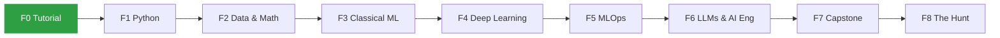

<div align="center">

# 🧠 Road to AI Engineer

**My public learning journey — from zero programming to Machine Learning, MLOps, LLMs and AI Engineering.**

[🇧🇷 Leia em português](./README.pt-BR.md) · [🗺️ Roadmap](./ROADMAP.en.md) · [📅 Study log](./LOG.md)


</div>

<!-- quest:start -->
> - ⚔️ **Current quest:** the game has not started yet — the first chain awaits.
> - 📜 **Latest from the saga:** [Prologue: The Ashes of Aethelgard](./saga/capitulos/00-prologo.en.md)
> - 🔥 **Streak:** 0 weeks · **Next level:** Apprentice (150 XP to go)
<!-- quest:end -->

---

## 👋 About me

_I'm Thales Gomes, learning in public to become an AI Engineer._

- 🎯 **Goal:** land my first ML / AI Engineer role
- 🌱 **Currently learning:** Git, GitHub and study habits (Phase 0)
- 📫 **Reach me:** [LinkedIn](https://www.linkedin.com/in/thales-gomes-2a6a12163/)

---

## 🎮 Progress

| Phase | Track | Weeks | Status | Boss 🐉 |
|:---:|---|:---:|:---:|---|
| 0 | [Tutorial](./tracks/00-tutorial/README.en.md) — Git, Colab, habit | 2 | 🟢 In progress | The Habit Guardian |
| 1 | [Python](./tracks/01-python/README.en.md) | 10 | 🔒 | The Toolmaker |
| 2 | [Data & Math](./tracks/02-data-math/README.en.md) — pandas, SQL, stats, linear algebra | 10 | 🔒 | The Data Oracle |
| 3 | [Classical ML](./tracks/03-classical-ml/README.en.md) — scikit-learn, Kaggle | 10 | 🔒 | The Kaggler |
| 4 | [Deep Learning](./tracks/04-deep-learning/README.en.md) — PyTorch, fast.ai | 10 | 🔒 | The Machine's Eye |
| 5 | [MLOps](./tracks/05-mlops/README.en.md) — Docker, FastAPI, MLflow, CI/CD | 12 | 🔒 | The Production Engineer |
| 6 | [LLMs & AI Engineering](./tracks/06-llms-ai-eng/README.en.md) — RAG, agents, evals | 12 | 🔒 | The RAG Architect |
| 7 | [Capstone & Career](./tracks/07-capstone-career/README.en.md) | 8 | 🔒 | The Capstone |
| 8 | [The Hunt](./tracks/08-the-hunt/README.en.md) — applications & interviews | open | 🔒 | The First Offer |



⛓️ **Played as a grimdark narrative RPG** — every mission advances a story in [`saga/`](./saga/README.en.md), published in Portuguese and English.

The full game — missions, XP, levels, achievements and every free resource — lives in **[ROADMAP.en.md](./ROADMAP.en.md)** ([Portuguese version](./ROADMAP.md)).

---

## 🏆 Featured projects

Each phase ends with a **boss fight**: a hands-on project published as its own repository.

| Project | Phase | Stack | Demo |
|---|:---:|---|:---:|
| _Coming soon — first boss unlocks in Phase 1_ | | | |

---

## 🧰 Stack I'm learning


---

## 🗂️ How this repo works

```
├── ROADMAP.md          # the game: phases, missions, XP, levels, achievements
│                       #   (every public doc has a *.en.md twin)
├── LOG.md              # one line per study session → weekly goal & streak
├── CONTEXT.md          # glossary of the game's vocabulary
├── tracks/             # one folder per phase
│   └── NN-name/
│       ├── README.md   #   missions + boss checklist
│       ├── notes/      #   my study notes (Portuguese)
│       └── exercises/  #   code & notebooks
├── projects/           # small projects (boss projects get their own repos)
├── saga/               # the RPG: chapters, character sheet, chronicle
├── brain/              # second brain (Obsidian vault): concept notes + maps
├── classroom/          # interactive lessons generated with Claude's /teach skill
├── templates/          # note & project README templates
└── docs/adr/           # decisions about how this repo is organized
```

**Study loop:** pick the next mission → study the free resource → write a note → solve the exercises → log the session → earn XP. Stuck? Generate a short interactive lesson with `/teach`, or ask a community.

**Rules of the game:** a weekly goal (3–4 sessions of 30+ min) instead of a fragile daily streak, XP only with evidence in the repo, and a mandatory boss project to unlock each phase. Details in [ROADMAP.en.md](./ROADMAP.en.md#regras).

---

<a id="play-it-yourself"></a>

## 🎲 Play it yourself

This roadmap is meant to be forked. To start your own run:

1. **Fork** this repository (and make sure your GitHub email is private — see [SECURITY](./SECURITY.md)).
2. **Reset the progress:** clear the session rows in `LOG.md`, set XP/level back to zero in `ROADMAP*.md` and the README badges, untick the checkboxes in `tracks/`, and reset `saga/ficha*.md` and `saga/cronica*.md` (keep the prologue). Delete `saga/cenas/*`.
3. **Make it yours:** rewrite `classroom/MISSION.md`, the *About me* section and the timeline to fit your life.
4. **Play:** open [Claude Code](https://claude.com/claude-code) in your fork and run `/mestre começar`. The skills in `.claude/skills/` come with the repo.

The plot pillars are the same for everyone — your choices are not. Credit this repo as described in the licenses below.

---

## 📄 License & security

- **Code:** [MIT](./LICENSE) · **Roadmap & notes:** [CC BY-SA 4.0](./LICENSE-CONTENT.md) · **Saga:** [CC BY-NC-SA 4.0](./LICENSE-CONTENT.md) · details in [LICENSE-CONTENT.md](./LICENSE-CONTENT.md)
- Security & privacy rules for this public repo: [SECURITY.md](./SECURITY.md)

---

## 📚 Highlights of the curriculum

All resources are **free**. A few favourites:

[CS50P](https://cs50.harvard.edu/python/) ·
[Kaggle Learn](https://www.kaggle.com/learn) ·
[3Blue1Brown](https://www.3blue1brown.com/) ·
[Andrew Ng's ML Specialization](https://www.coursera.org/specializations/machine-learning-introduction) ·
[fast.ai](https://course.fast.ai/) ·
[Karpathy's Zero to Hero](https://karpathy.ai/zero-to-hero.html) ·
[MLOps Zoomcamp](https://github.com/DataTalksClub/mlops-zoomcamp) ·
[Made With ML](https://madewithml.com/) ·
[Hugging Face LLM Course](https://huggingface.co/learn/llm-course) ·
[Anthropic Courses](https://github.com/anthropics/courses)

---

<div align="center">

_Learning in public, one session at a time._ 🌱

</div>
