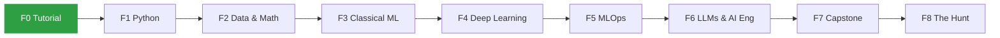

<div align="center">

# 🧠 Road to AI Engineer

**My public learning journey — from zero programming to Machine Learning, MLOps, LLMs and AI Engineering.**

[🇧🇷 Leia em português](./README.pt-BR.md) · [🗺️ Roadmap](./ROADMAP.md) · [📅 Study log](./LOG.md)


</div>

---

## 👋 About me

<!-- TODO: 2–3 sentences in your own words: who you are, where you're coming from, what you want to build. -->
_I'm **&lt;your name&gt;**, learning in public to become an AI Engineer. &lt;One sentence about your background.&gt;_

- 🎯 **Goal:** land my first ML / AI Engineer role
- 🌱 **Currently learning:** Git, GitHub and study habits (Phase 0)
- 📫 **Reach me:** <!-- TODO --> [LinkedIn](https://www.linkedin.com/in/&lt;your-handle&gt;) · &lt;your-email&gt;

---

## 🎮 Progress

| Phase | Track | Weeks | Status | Boss 🐉 |
|:---:|---|:---:|:---:|---|
| 0 | [Tutorial](./tracks/00-tutorial/) — Git, Colab, habit | 2 | 🟢 In progress | The Habit Guardian |
| 1 | [Python](./tracks/01-python/) | 10 | 🔒 | The Toolmaker |
| 2 | [Data & Math](./tracks/02-data-math/) — pandas, SQL, stats, linear algebra | 10 | 🔒 | The Data Oracle |
| 3 | [Classical ML](./tracks/03-classical-ml/) — scikit-learn, Kaggle | 10 | 🔒 | The Kaggler |
| 4 | [Deep Learning](./tracks/04-deep-learning/) — PyTorch, fast.ai | 10 | 🔒 | The Machine's Eye |
| 5 | [MLOps](./tracks/05-mlops/) — Docker, FastAPI, MLflow, CI/CD | 12 | 🔒 | The Production Engineer |
| 6 | [LLMs & AI Engineering](./tracks/06-llms-ai-eng/) — RAG, agents, evals | 12 | 🔒 | The RAG Architect |
| 7 | [Capstone & Career](./tracks/07-capstone-career/) | 8 | 🔒 | The Capstone |
| 8 | [The Hunt](./tracks/08-the-hunt/) — applications & interviews | open | 🔒 | The First Offer |



⛓️ **Played as a grimdark narrative RPG** — every mission advances a story in [`saga/`](./saga/) (in Portuguese).

The full game — missions, XP, levels, achievements and every free resource — lives in **[ROADMAP.md](./ROADMAP.md)** (in Portuguese).

---

## 🏆 Featured projects

Each phase ends with a **boss fight**: a hands-on project published as its own repository.

| Project | Phase | Stack | Demo |
|---|:---:|---|:---:|
| _Coming soon — first boss unlocks in Phase 1_ | | | |

---

## 🧰 Stack I'm learning


---

## 🗂️ How this repo works

```
├── ROADMAP.md          # the game: phases, missions, XP, levels, achievements
├── LOG.md              # one line per study session → weekly goal & streak
├── CONTEXT.md          # glossary of the game's vocabulary
├── tracks/             # one folder per phase
│   └── NN-name/
│       ├── README.md   #   missions + boss checklist
│       ├── notes/      #   my study notes (Portuguese)
│       └── exercises/  #   code & notebooks
├── projects/           # small projects (boss projects get their own repos)
├── saga/               # the RPG: chapters, character sheet, chronicle
├── classroom/          # interactive lessons generated with Claude's /teach skill
├── templates/          # note & project README templates
└── docs/adr/           # decisions about how this repo is organized
```

**Study loop:** pick the next mission → study the free resource → write a note → solve the exercises → log the session → earn XP. Stuck? Generate a short interactive lesson with `/teach`, or ask a community.

**Rules of the game:** a weekly goal (3–4 sessions of 30+ min) instead of a fragile daily streak, XP only with evidence in the repo, and a mandatory boss project to unlock each phase. Details in [ROADMAP.md](./ROADMAP.md#regras).

---

## 📚 Highlights of the curriculum

All resources are **free**. A few favourites:

[CS50P](https://cs50.harvard.edu/python/) ·
[Kaggle Learn](https://www.kaggle.com/learn) ·
[3Blue1Brown](https://www.3blue1brown.com/) ·
[Andrew Ng's ML Specialization](https://www.coursera.org/specializations/machine-learning-introduction) ·
[fast.ai](https://course.fast.ai/) ·
[Karpathy's Zero to Hero](https://karpathy.ai/zero-to-hero.html) ·
[MLOps Zoomcamp](https://github.com/DataTalksClub/mlops-zoomcamp) ·
[Made With ML](https://madewithml.com/) ·
[Hugging Face LLM Course](https://huggingface.co/learn/llm-course) ·
[Anthropic Courses](https://github.com/anthropics/courses)

---

<div align="center">

_Learning in public, one session at a time._ 🌱

</div>
