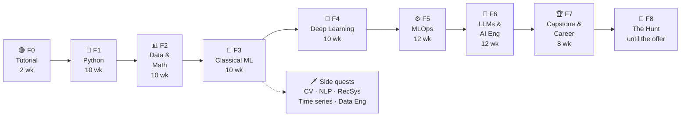

<p align="center"></p>

# 🗺️ Roadmap — From Zero to AI Engineer

[🇧🇷 Português](./ROADMAP.md) · 🇺🇸 **English**

> ⛓️ This roadmap is played as a narrative RPG: see the [saga](./saga/README.en.md). Missions are reported with `/mestre`.

> A ~18-month game (≈74 weeks, 8–10 h/week) to go from zero programming to a first job as an **ML / MLOps / AI Engineer**.
> Full rules in [How the game works](#regras).

> **Contents:** [Dashboard](#painel) · [Map](#mapa) · [Rules](#regras) · [Levels](#niveis) · [Achievements](#conquistas) · [P0](#fase-0) · [P1](#fase-1) · [P2](#fase-2) · [P3](#fase-3) · [P4](#fase-4) · [P5](#fase-5) · [P6](#fase-6) · [P7](#fase-7) · [P8](#fase-8) · [Side quests](#side-quests) · [Communities](#comunidades)

---

<a id="painel"></a>

## 🎮 Player dashboard

<!-- sync:panel -->
| Level | Total XP | Current phase | Streak | Bosses defeated |
|:---:|:---:|:---:|:---:|:---:|
| **0 · Recruit** | **0** / 150 | 🟢 Phase 0 — Tutorial | 🔥 0 weeks | 0 / 9 |

```
XP  [░░░░░░░░░░░░░░░░░░░░]  0%   → next level: Apprentice (150 XP)
```

> Generated from [`progress.yml`](./progress.yml) by `scripts/sync.py`. Do not edit by hand.
<!-- /sync:panel -->

---

<a id="mapa"></a>

## 🧭 Map



<!-- sync:phases -->
| Phase | Name | Weeks | Phase XP | 🐉 Boss | Status |
|:---:|---|:---:|:---:|---|:---:|
| 0 | [Tutorial](./tracks/00-tutorial/README.en.md) | 2 | 150 | The Habit Guardian | 🟢 Current |
| 1 | [Python](./tracks/01-python/README.en.md) | 10 | 670 | The Toolmaker | 🔒 |
| 2 | [Data & Math](./tracks/02-data-math/README.en.md) | 10 | 700 | The Data Oracle | 🔒 |
| 3 | [Classical ML](./tracks/03-classical-ml/README.en.md) | 10 | 800 | The Kaggler | 🔒 |
| 4 | [Deep Learning](./tracks/04-deep-learning/README.en.md) | 10 | 800 | The Machine's Eye | 🔒 |
| 5 | [MLOps](./tracks/05-mlops/README.en.md) | 12 | 1000 | The Production Engineer | 🔒 |
| 6 | [LLMs & AI Engineering](./tracks/06-llms-ai-eng/README.en.md) | 12 | 1000 | The RAG Architect | 🔒 |
| 7 | [Capstone & Career](./tracks/07-capstone-career/README.en.md) | 8 | 800 | The Capstone | 🔒 |
| 8 | [The Hunt](./tracks/08-the-hunt/README.en.md) | open | 500 | The First Offer | 🔒 |
<!-- /sync:phases -->

In the [saga](./saga/README.en.md): **F0 = Prologue** (the chains), **F1–F8 = Circles 1–8**, and **the signed job offer = Circle 9**, the epilogue.

Status: 🟢 current · ✅ done · 🔒 locked (unlocks when the previous boss falls).

> **Progressive detail:** phases 0 and 1 have detailed missions. Phases 2–8 have topics, resources and boss defined; their missions are written when they unlock, because resources change.

---

<a id="regras"></a>

## 📜 How the game works

### Sessions and weekly goal

- **Standard session**: ≥ 30 min of focused study, logged as one line in [`LOG.md`](./LOG.md) (kept in Portuguese).
- **Minimum session** (bad day): 15 min — review flashcards in Obsidian, review a note, read one page, redo one exercise. Counts as a session, **at most once a week**.
- **Weekly goal**: **3 sessions** in month 1 → **4 sessions** from month 2.
- A week runs Monday to Sunday. Counting starts at **`/mestre começar`**; the days up to the first Sunday are a **warm-up week** (mission XP counts, but not the weekly goal or streak).

### XP sources

| Action | XP |
|---|:---:|
| 🗒️ Mission completed | 10 – 50 (listed on each mission) |
| 🐉 Boss defeated | 50 – 500 (listed on each phase) |
| 🗡️ Side quest completed | 20 – 150 |
| 📅 Weekly goal met | +20 |
| 🔥 Every 4 weeks of streak | +50 bonus |
| 🎓 Lesson completed with `/teach` (quiz done) | +10 |

**Rules:**

1. A mission only earns XP with **evidence in the repo**: a note in `notes/` (plus the `brain/` concept notes it links), code in `exercises/`, or a link in `LOG.md`.
2. Bosses are **mandatory** to unlock the next phase. Missions may lag behind as long as the boss is defeated.
3. Broke the streak? No penalty — the count just restarts. Earned XP is never lost.
4. Stuck on a mission for more than 2 sessions? Open a `/teach` lesson or ask a [community](#comunidades). Asking for help is part of the game.

<a id="niveis"></a>

### Levels

| Lv | Title | Min XP | Extra requirement |
|:---:|---|:---:|---|
| 0 | Recruit | 0 | — |
| 1 | Apprentice | 150 | Boss F0 |
| 2 | Pythonista | 800 | Boss F1 |
| 3 | Data Explorer | 1 600 | Boss F2 |
| 4 | Junior ML Scientist | 2 500 | Boss F3 |
| 5 | Deep Learner | 3 400 | Boss F4 |
| 6 | MLOps Engineer | 4 500 | Boss F5 |
| 7 | AI Engineer | 5 600 | Boss F6 |
| 8 | Veteran — full portfolio | 6 500 | Boss F7 |
| 9 | 🏆 Legend — hired | 7 000 | Boss F8 |

A level goes up only when **both** conditions are met (min XP **and** that phase's boss).

> **Consistency counts:** from Lv 3 on, phase XP alone is not enough — **weekly bonuses** (+20, +50 every 4 weeks) and side quests close the gap. Example: phases 0–8 give 6,420 XP; the remaining 580 for Lv 9 equal ~29 weeks of goals met, out of ~74.

<a id="conquistas"></a>

### 🏅 Achievements

<!-- sync:achievements -->
| | Achievement | How to unlock | Date |
|:---:|---|---|:---:|
| 🌱 | First Commit | Make the first commit in this repo | |
| 📓 | First Notebook | Run and save a Colab notebook in the repo | |
| 🔥 | On Fire | 4 weeks in a row meeting the goal | |
| 🌋 | Unstoppable | 12 weeks in a row meeting the goal | |
| 💻 | Left Colab | Run Python locally in VS Code | |
| 🧪 | Tested | Write the first passing automated test | |
| 📊 | Storyteller | Publish an EDA with charts and conclusions | |
| 🏁 | First Submission | Submit to a Kaggle competition | |
| 🧠 | Neuron Fired | Train the first neural network | |
| 🚀 | Live | First model with a public URL (HF Spaces, Render…) | |
| 🐳 | Containerized | First `docker build` of your own project | |
| 🤖 | Automated | First passing GitHub Actions workflow **written by you** | |
| 🔎 | Retriever | First working RAG system | |
| ✍️ | Teacher | Publish a post explaining something you learned | |
| 🤝 | Community | Answer someone else's question in a community | |
| 🕸️ | Second Brain | 25 interlinked concept notes in `brain/concepts/` | |
| 🎯 | Candidate | Send the first application for an ML/AI role | |
<!-- /sync:achievements -->

---

<a id="fase-0"></a>

## 🟢 Phase 0 — Tutorial · 2 weeks · 150 XP

Set up the environment and, above all, **build the habit**. Detailed missions in [`tracks/00-tutorial/`](./tracks/00-tutorial/README.en.md).

**🐉 Boss — The Habit Guardian (50 XP):** 2 weeks in a row meeting the goal (3 sessions) **and** every mission of the phase done.

---

<a id="fase-1"></a>

## 🐍 Phase 1 — Python · 10 weeks · 670 XP

Programming logic and Python from zero to object-oriented programming and tests. Detailed missions in [`tracks/01-python/`](./tracks/01-python/README.en.md).

| Main resource | Portuguese alternative |
|---|---|
| [CS50P — Harvard](https://cs50.harvard.edu/python/) (free, with free certificate) | [Curso em Vídeo — Python 3](https://www.cursoemvideo.com/curso/python-3-mundo-1/) · [Pense em Python, 3rd ed. (translation)](https://rodrigocarlson.github.io/PensePython3ed/) |

**🐉 Boss — The Toolmaker (200 XP):** the CS50P final project published as **its own repository**, with a README, tests (`pytest`) and usage instructions.

---

<a id="fase-2"></a>

## 📊 Phase 2 — Data & Math · 10 weeks · 700 XP

**Topics:** NumPy · pandas · visualization (matplotlib/seaborn) · SQL · descriptive and inferential statistics · probability · **intuitive** linear algebra and calculus (vectors, matrices, derivatives, gradients).

| Area | Main resource | Alternative / extra |
|---|---|---|
| pandas | [Kaggle Learn — Pandas](https://www.kaggle.com/learn/pandas) · [Python for Data Analysis, 3E (open book)](https://wesmckinney.com/book/) | [Python Data Science Handbook](https://jakevdp.github.io/PythonDataScienceHandbook/) |
| SQL | [SQLBolt](https://sqlbolt.com/) · [Kaggle Learn — Intro to SQL](https://www.kaggle.com/learn/intro-to-sql) | — |
| Statistics | [Khan Academy — Statistics & probability](https://www.khanacademy.org/math/statistics-probability) · [StatQuest](https://www.youtube.com/@statquest) | [OpenIntro Statistics (free book)](https://www.openintro.org/book/os/) |
| Linear algebra | [3Blue1Brown — Essence of Linear Algebra](https://www.3blue1brown.com/topics/linear-algebra) | [Mathematics for Machine Learning (free book)](https://mml-book.github.io/) |
| Calculus | [3Blue1Brown — Essence of Calculus](https://www.3blue1brown.com/topics/calculus) | Khan Academy — Calculus |

**🐉 Boss — The Data Oracle (250 XP):** a complete exploratory data analysis (EDA) of a real public dataset (e.g. [dados.gov.br](https://dados.gov.br/), Kaggle) — questions, cleaning, charts, one SQL query and written conclusions. Published as a well-documented notebook.

---

<a id="fase-3"></a>

## 🌳 Phase 3 — Classical ML · 10 weeks · 800 XP

**Topics:** supervised vs. unsupervised learning · linear and logistic regression · trees, random forest, gradient boosting · cross-validation · metrics · overfitting · feature engineering · scikit-learn pipelines · clustering.

| Main resource | Extra |
|---|---|
| [Machine Learning Specialization — Andrew Ng](https://www.coursera.org/specializations/machine-learning-introduction) (free in "audit" mode) | [Google ML Crash Course](https://developers.google.com/machine-learning/crash-course) |
| [Kaggle Learn — Intro to ML](https://www.kaggle.com/learn/intro-to-machine-learning) + [Intermediate ML](https://www.kaggle.com/learn/intermediate-machine-learning) | [ISLP — Intro to Statistical Learning (Python, free book)](https://www.statlearning.com/) |
| [scikit-learn — official tutorials](https://scikit-learn.org/stable/tutorial/index.html) | [StatQuest](https://www.youtube.com/@statquest) for intuition on each algorithm |

**🐉 Boss — The Kaggler (300 XP):** an end-to-end model in a Kaggle competition (e.g. [Titanic](https://www.kaggle.com/competitions/titanic) or [House Prices](https://www.kaggle.com/competitions/house-prices-advanced-regression-techniques)) — EDA → baseline → scikit-learn pipeline → cross-validation → submission → README explaining decisions. **Own repository.**

**🗡️ Side quests unlocked:** optional specializations from here on (see [Side quests](#side-quests)).

---

<a id="fase-4"></a>

## 🧠 Phase 4 — Deep Learning · 10 weeks · 800 XP

**Topics:** neural networks and backpropagation · PyTorch · training, loss, optimizers · CNNs and vision · transfer learning · intro to embeddings and transformers.

| Main resource | Extra |
|---|---|
| [fast.ai — Practical Deep Learning for Coders](https://course.fast.ai/) | [Dive into Deep Learning (free book, PyTorch)](https://d2l.ai/) |
| [PyTorch — Learn the Basics](https://docs.pytorch.org/tutorials/beginner/basics/intro.html) | [Understanding Deep Learning — Simon Prince (free PDF)](https://udlbook.github.io/udlbook/) |
| [Karpathy — Neural Networks: Zero to Hero](https://karpathy.ai/zero-to-hero.html) (first 3 lectures) | [3Blue1Brown — Neural Networks](https://www.3blue1brown.com/topics/neural-networks) |

**🐉 Boss — The Machine's Eye (300 XP):** an image classifier with transfer learning, published as a demo on [Hugging Face Spaces](https://huggingface.co/spaces) (Gradio), with a README showing metrics and model errors. **Own repository.**

---

<a id="fase-5"></a>

## ⚙️ Phase 5 — MLOps · 12 weeks · 1000 XP

**Topics:** reproducible environments (uv/venv) · advanced Git · Docker · APIs with FastAPI · experiment tracking (MLflow) · pipeline orchestration · CI/CD with GitHub Actions · data and model tests · monitoring and drift · cloud basics · data pipelines (supporting data engineering).

| Main resource | Extra |
|---|---|
| [MLOps Zoomcamp — DataTalks.Club](https://github.com/DataTalksClub/mlops-zoomcamp) (self-paced, free) | [Made With ML — MLOps Course](https://madewithml.com/) |
| [Docker — Get Started](https://docs.docker.com/get-started/) | [The Missing Semester — MIT](https://missing.csail.mit.edu/) (shell, Git, tools) |
| [FastAPI — Tutorial](https://fastapi.tiangolo.com/tutorial/) | [MLflow — Docs](https://mlflow.org/docs/latest/index.html) |
| [GitHub Actions — Docs](https://docs.github.com/en/actions) | [Data Engineering Zoomcamp](https://github.com/DataTalksClub/data-engineering-zoomcamp) (selected modules) |

**🐉 Boss — The Production Engineer (400 XP), in two parts:**
1. Take the F3 or F4 boss model to production: FastAPI + Docker + MLflow + CI/CD with tests + deploy with a public URL + basic monitoring.
2. **Rewrite this repository's automation in your own code:** today progress is synced by `scripts/sync.py` (written by Claude) and checked by `scripts/qa.py` in CI. Study both and rewrite them from scratch, your way: tested modules with `pytest`, a GitHub Action **of your own** running the tests, and the sync running automatically in CI on every push.

---

<a id="fase-6"></a>

## 🤖 Phase 6 — LLMs & AI Engineering · 12 weeks · 1000 XP

**Topics:** how LLMs work (tokens, embeddings, attention) · using LLM APIs · prompt engineering · structured outputs · embeddings and vector search · RAG · tool use and agents · evaluation (evals) · fine-tuning (LoRA) · cost, latency and safety.

| Main resource | Extra |
|---|---|
| [Hugging Face — LLM Course](https://huggingface.co/learn/llm-course) | [Karpathy — Let's build GPT](https://karpathy.ai/zero-to-hero.html) (last Zero to Hero lectures) |
| [Anthropic — Courses](https://github.com/anthropics/courses) (API, prompting, evals, tool use) | [Prompt Engineering Guide](https://www.promptingguide.ai/) |
| [LLM Zoomcamp — DataTalks.Club](https://github.com/DataTalksClub/llm-zoomcamp) (hands-on RAG) | [mlabonne/llm-course](https://github.com/mlabonne/llm-course) (LLM Engineer roadmap) |
| [Hugging Face — AI Agents Course](https://huggingface.co/learn/agents-course) | [Anthropic — Building Effective Agents](https://www.anthropic.com/engineering/building-effective-agents) · [Hamel Husain — Your AI Product Needs Evals](https://hamel.dev/blog/posts/evals/) |

**🐉 Boss — The RAG Architect (400 XP):** a published RAG application over a real domain (e.g. documentation, laws, papers), with an API, a simple UI, an **evaluation set** measuring answer quality, and a README with architecture and results. **Own repository.**

---

<a id="fase-7"></a>

## 🏆 Phase 7 — Capstone & Career · 8 weeks · 800 XP

**Topics:** integrating project · portfolio · LinkedIn and GitHub profile · technical writing · interview prep (ML, ML system design, Python).

| Resource | Use |
|---|---|
| [Chip Huyen — Introduction to ML Interviews Book](https://huyenchip.com/ml-interviews-book/) | Interview questions and career paths |
| [Chip Huyen — MLOps guide](https://huyenchip.com/mlops/) | ML systems design reference |
| [roadmap.sh — AI Engineer](https://roadmap.sh/ai-engineer) · [MLOps](https://roadmap.sh/mlops) | Find gaps before interviews |
| [NeetCode Roadmap](https://neetcode.io/roadmap) | Algorithms (basics only: arrays, hashing, two pointers) |

**🐉 Boss — The Capstone (500 XP):** a capstone combining ML + MLOps + LLMs on a problem of your choice, with deploy, CI/CD, evaluation and a post explaining it. **Bonus:** an interactive web page for this roadmap (XP bar, skill tree, achievements) as a front-end project.

---

<a id="fase-8"></a>

## 🎯 Phase 8 — The Hunt · open-ended · 500 XP

Turn the portfolio into interviews, and interviews into an offer. Missions are written when the phase unlocks.

**Topics:** portfolio and README review · LinkedIn and GitHub profile · applications (goal: 20) · mock interviews (technical, ML system design, behavioral) · networking in communities and events.

| Resource | Use |
|---|---|
| [Chip Huyen — Introduction to ML Interviews Book](https://huyenchip.com/ml-interviews-book/) | Hiring process and questions by role |
| [Communities](#comunidades) | Referrals, résumé feedback, openings |

**🐉 Boss — The First Offer (300 XP):** receive an offer for an ML / MLOps / AI Engineer role.

**🌟 Circle 9 — Epilogue:** accept the offer. Level **9 · Legend** and the saga's final chapter: the skies open.

---

<a id="side-quests"></a>

## 🗡️ Side quests

Optional, unlocked from Phase 3. They earn XP (listed) and strengthen the portfolio.

| Side quest | XP | Resource |
|---|:---:|---|
| Exercism — Python track (20 exercises) | 100 | [exercism.org/tracks/python](https://exercism.org/tracks/python) |
| Curso em Vídeo — Python Worlds 2 and 3 (PT) | 100 | [cursoemvideo.com](https://www.cursoemvideo.com/cursos/) |
| Full ML Zoomcamp | 150 | [DataTalksClub/machine-learning-zoomcamp](https://github.com/DataTalksClub/machine-learning-zoomcamp) |
| Computer vision — detection project | 150 | fast.ai + [d2l.ai CV chapter](https://d2l.ai/) |
| Classical NLP — Portuguese text classifier | 100 | [Hugging Face LLM Course](https://huggingface.co/learn/llm-course) |
| Simple recommender system | 120 | [Google — Recommendation Systems](https://developers.google.com/machine-learning/recommendation) |
| Time series — demand forecasting | 120 | Kaggle Learn — Time Series |
| Data engineering — pipeline with an orchestrator | 150 | [Data Engineering Zoomcamp](https://github.com/DataTalksClub/data-engineering-zoomcamp) |
| Git in depth | 50 | [Learn Git Branching](https://learngitbranching.js.org/) — all levels |
| Write a technical post | 50 | Any platform (dev.to, Medium, LinkedIn) |

---

<a id="comunidades"></a>

## 🤝 Communities

Where to ask questions and gain real-world wisdom.

- [DataTalks.Club Slack](https://datatalks.club/slack.html) — Zoomcamp channels, very active.
- [fast.ai forums](https://forums.fast.ai/) — Deep Learning course questions.
- [Hugging Face Discord](https://huggingface.co/join/discord) — LLMs, agents, HF courses.
- [r/learnmachinelearning](https://www.reddit.com/r/learnmachinelearning/) — ML beginners.
- [Kaggle Discussions](https://www.kaggle.com/discussions) — competitions and notebooks.
- [Python Brasil](https://python.org.br/) — Brazilian Python community.

---

## 📦 Every resource is free

All links above are free to study. Some charge only for certificates (Coursera, Curso em Vídeo) — a certificate is **not** needed. Links checked on 2026-09-29; if one breaks, open an issue with the `needs-triage` label.
