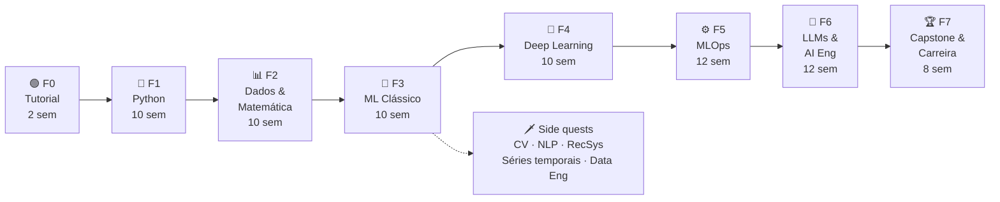

# 🗺️ Roadmap — Do Zero a AI Engineer

> Um jogo de ~18 meses (≈74 semanas, 8–10 h/semana) para sair do zero em programação até a primeira vaga como **ML / MLOps / AI Engineer**.
> Regras completas em [Como o jogo funciona](#regras). Vocabulário em [`CONTEXT.md`](./CONTEXT.md).

---

## 🎮 Painel do jogador

| Nível | XP total | Fase atual | Streak | Chefões vencidos |
|:---:|:---:|:---:|:---:|:---:|
| **0 · Recruta** | **0** / 150 | 🟢 Fase 0 — Tutorial | 🔥 0 semanas | 0 / 8 |

```
XP  [░░░░░░░░░░░░░░░░░░░░]  0%   → próximo nível: Aprendiz (150 XP)
```

> Atualize este painel (e o do README) sempre que ganhar XP. Na Fase 5 você vai automatizar isso — é o chefão de MLOps.

---

## 🧭 Mapa



| Fase | Nome | Semanas | XP da fase | 🐉 Chefão | Status |
|:---:|---|:---:|:---:|---|:---:|
| 0 | [Tutorial](./tracks/00-tutorial/) | 2 | 150 | O Guardião do Hábito | 🟢 Atual |
| 1 | [Python](./tracks/01-python/) | 10 | 670 | O Construtor de Ferramentas | 🔒 |
| 2 | [Dados & Matemática](./tracks/02-data-math/) | 10 | 700 | O Oráculo dos Dados | 🔒 |
| 3 | [ML Clássico](./tracks/03-classical-ml/) | 10 | 800 | O Kaggler | 🔒 |
| 4 | [Deep Learning](./tracks/04-deep-learning/) | 10 | 800 | O Olho da Máquina | 🔒 |
| 5 | [MLOps](./tracks/05-mlops/) | 12 | 1000 | O Engenheiro de Produção | 🔒 |
| 6 | [LLMs & AI Engineering](./tracks/06-llms-ai-eng/) | 12 | 1000 | O Arquiteto de RAG | 🔒 |
| 7 | [Capstone & Carreira](./tracks/07-capstone-career/) | 8 | 800 | O Chefão Final | 🔒 |

Status: 🟢 atual · ✅ concluída · 🔒 bloqueada (desbloqueia ao vencer o chefão anterior).

> **Detalhe progressivo:** as fases 0 e 1 têm missões detalhadas. As fases 2–7 têm tópicos, materiais e chefão definidos; as missões são detalhadas quando você chegar nelas (materiais mudam — ver [ADR 0001](./docs/adr/0001-roadmap-gamificado-com-detalhe-progressivo.md)).

---

<a id="regras"></a>

## 📜 Como o jogo funciona

### Sessões e meta semanal

- **Sessão padrão**: ≥ 30 min de estudo focado. Registre uma linha no [`LOG.md`](./LOG.md).
- **Sessão mínima** (dia ruim): 15 min — revisar uma nota, ler 1 página, refazer 1 exercício. Conta como sessão, **no máximo 1 por semana**.
- **Meta semanal**: **3 sessões** no 1º mês → **4 sessões** a partir do 2º mês.
- Semana = segunda a domingo.

### Fontes de XP

| Ação | XP |
|---|:---:|
| 🗒️ Missão concluída | 10 – 50 (indicado em cada missão) |
| 🐉 Chefão vencido | 50 – 500 (indicado em cada fase) |
| 🗡️ Side quest concluída | 20 – 150 |
| 📅 Meta semanal batida | +20 |
| 🔥 A cada 4 semanas seguidas de streak | +50 bônus |
| 🎓 Aula concluída com `/teach` (com quiz feito) | +10 |

**Regras:**

1. Missão só vale XP com **evidência no repo**: nota em `notes/`, código em `exercises/`, ou link no `LOG.md`.
2. Chefão é **obrigatório** para desbloquear a próxima fase. Missões de uma fase podem ficar para trás, desde que o chefão seja vencido.
3. Streak quebrou? Sem punição — só recomeça a contagem. O XP ganho nunca é perdido.
4. Travou numa missão por mais de 2 sessões? Abra uma aula com `/teach` ou pergunte numa [comunidade](#comunidades). Pedir ajuda é parte do jogo.

### Níveis

| Nv | Título | XP mínimo | Requisito extra |
|:---:|---|:---:|---|
| 0 | Recruta | 0 | — |
| 1 | Aprendiz | 150 | Chefão F0 |
| 2 | Pythonista | 800 | Chefão F1 |
| 3 | Explorador de Dados | 1 600 | Chefão F2 |
| 4 | Cientista de ML Júnior | 2 500 | Chefão F3 |
| 5 | Deep Learner | 3 400 | Chefão F4 |
| 6 | MLOps Engineer | 4 500 | Chefão F5 |
| 7 | AI Engineer | 5 600 | Chefão F6 |
| 8 | 🏆 Lenda — pronto para o mercado | 6 500 | Chefão F7 |

O nível sobe quando **as duas** condições são atendidas (XP mínimo **e** chefão da fase).

### 🏅 Conquistas

| | Conquista | Como desbloquear | Data |
|:---:|---|---|:---:|
| 🌱 | Primeiro Commit | Fazer o primeiro commit neste repo | |
| 📓 | Primeiro Notebook | Rodar e salvar um notebook do Colab no repo | |
| 🔥 | Em Chamas | 4 semanas seguidas batendo a meta | |
| 🌋 | Imparável | 12 semanas seguidas batendo a meta | |
| 💻 | Saí do Colab | Rodar Python localmente no VS Code | |
| 🧪 | Testado | Escrever o primeiro teste automatizado que passa | |
| 📊 | Contador de Histórias | Publicar uma EDA com gráficos e conclusões | |
| 🏁 | Primeira Submissão | Submeter numa competição do Kaggle | |
| 🧠 | Neurônio Ativado | Treinar a primeira rede neural | |
| 🚀 | No Ar | Primeiro modelo com URL pública (HF Spaces, Render…) | |
| 🐳 | Containerizado | Primeiro `docker build` de um projeto seu | |
| 🤖 | Automatizado | Primeiro workflow de GitHub Actions passando | |
| 🔎 | Recuperador | Primeiro sistema RAG funcionando | |
| ✍️ | Professor | Publicar um post/artigo explicando algo que aprendeu | |
| 🤝 | Comunidade | Responder a dúvida de outra pessoa numa comunidade | |
| 🎯 | Candidato | Enviar a primeira candidatura para vaga de ML/AI | |

Marque a data na coluna ao desbloquear.

---

<a id="fase-0"></a>

## 🟢 Fase 0 — Tutorial · 2 semanas · 150 XP

Montar o ambiente e, principalmente, **criar o hábito**. Missões detalhadas em [`tracks/00-tutorial/`](./tracks/00-tutorial/).

**🐉 Chefão — O Guardião do Hábito (50 XP):** 2 semanas seguidas batendo a meta (3 sessões) **e** todas as missões da fase concluídas.

---

<a id="fase-1"></a>

## 🐍 Fase 1 — Python · 10 semanas · 670 XP

Lógica de programação e Python do zero até orientação a objetos e testes. Missões detalhadas em [`tracks/01-python/`](./tracks/01-python/).

| Material principal | Alternativa em PT-BR |
|---|---|
| [CS50P — Harvard](https://cs50.harvard.edu/python/) (gratuito, com certificado gratuito) | [Curso em Vídeo — Python 3 (Mundos 1–3)](https://www.cursoemvideo.com/curso/python-3-mundo-1/) · [Pense em Python, 3ª ed. (tradução)](https://rodrigocarlson.github.io/PensePython3ed/) |

**🐉 Chefão — O Construtor de Ferramentas (200 XP):** projeto final do CS50P publicado como **repositório próprio**, com README, testes (`pytest`) e instruções de uso.

---

<a id="fase-2"></a>

## 📊 Fase 2 — Dados & Matemática · 10 semanas · 700 XP

**Tópicos:** NumPy · pandas · visualização (matplotlib/seaborn) · SQL · estatística descritiva e inferencial · probabilidade · álgebra linear e cálculo **intuitivos** (vetores, matrizes, derivadas, gradiente).

| Área | Material principal | Alternativa / complemento |
|---|---|---|
| pandas | [Kaggle Learn — Pandas](https://www.kaggle.com/learn/pandas) · [Python for Data Analysis, 3E (livro aberto)](https://wesmckinney.com/book/) | [Python Data Science Handbook](https://jakevdp.github.io/PythonDataScienceHandbook/) |
| SQL | [SQLBolt](https://sqlbolt.com/) · [Kaggle Learn — Intro to SQL](https://www.kaggle.com/learn/intro-to-sql) | — |
| Estatística | [Khan Academy — Estatística e probabilidade](https://pt.khanacademy.org/math/statistics-probability) (PT) · [StatQuest](https://www.youtube.com/@statquest) | [OpenIntro Statistics (livro grátis)](https://www.openintro.org/book/os/) |
| Álgebra linear | [3Blue1Brown — Essence of Linear Algebra](https://www.3blue1brown.com/topics/linear-algebra) (legendas PT) | [Mathematics for Machine Learning (livro grátis)](https://mml-book.github.io/) |
| Cálculo | [3Blue1Brown — Essence of Calculus](https://www.3blue1brown.com/topics/calculus) | Khan Academy — Cálculo (PT) |

**🐉 Chefão — O Oráculo dos Dados (250 XP):** análise exploratória (EDA) completa de um dataset público real (ex.: [dados.gov.br](https://dados.gov.br/), Kaggle) — perguntas, limpeza, gráficos, uma consulta SQL e conclusões escritas. Publicada como notebook bem documentado.

---

<a id="fase-3"></a>

## 🌳 Fase 3 — ML Clássico · 10 semanas · 800 XP

**Tópicos:** o que é aprendizado supervisionado/não supervisionado · regressão linear e logística · árvores, random forest, gradient boosting · validação cruzada · métricas · overfitting · feature engineering · pipelines do scikit-learn · clustering.

| Material principal | Complemento |
|---|---|
| [Machine Learning Specialization — Andrew Ng](https://www.coursera.org/specializations/machine-learning-introduction) (gratuito no modo "auditar") | [Google ML Crash Course](https://developers.google.com/machine-learning/crash-course) |
| [Kaggle Learn — Intro to ML](https://www.kaggle.com/learn/intro-to-machine-learning) + [Intermediate ML](https://www.kaggle.com/learn/intermediate-machine-learning) | [ISLP — Intro to Statistical Learning (Python, livro grátis)](https://www.statlearning.com/) |
| [scikit-learn — tutoriais oficiais](https://scikit-learn.org/stable/tutorial/index.html) | [StatQuest](https://www.youtube.com/@statquest) para intuição de cada algoritmo |

**🐉 Chefão — O Kaggler (300 XP):** modelo de ponta a ponta numa competição do Kaggle (ex.: [Titanic](https://www.kaggle.com/competitions/titanic) ou [House Prices](https://www.kaggle.com/competitions/house-prices-advanced-regression-techniques)) — EDA → baseline → pipeline scikit-learn → validação cruzada → submissão → README explicando decisões. **Repositório próprio.**

**🗡️ Side quests desbloqueadas:** a partir daqui, especializações opcionais (ver [Side quests](#side-quests)).

---

<a id="fase-4"></a>

## 🧠 Fase 4 — Deep Learning · 10 semanas · 800 XP

**Tópicos:** redes neurais e backpropagation · PyTorch · treino, loss, otimizadores · CNNs e visão · transfer learning · introdução a embeddings e transformers.

| Material principal | Complemento |
|---|---|
| [fast.ai — Practical Deep Learning for Coders](https://course.fast.ai/) | [Dive into Deep Learning (livro grátis, PyTorch)](https://d2l.ai/) |
| [PyTorch — Learn the Basics](https://docs.pytorch.org/tutorials/beginner/basics/intro.html) | [Understanding Deep Learning — Simon Prince (PDF grátis)](https://udlbook.github.io/udlbook/) |
| [Karpathy — Neural Networks: Zero to Hero](https://karpathy.ai/zero-to-hero.html) (as 3 primeiras aulas) | [3Blue1Brown — Neural Networks](https://www.3blue1brown.com/topics/neural-networks) |

**🐉 Chefão — O Olho da Máquina (300 XP):** classificador de imagens com transfer learning, publicado como demo no [Hugging Face Spaces](https://huggingface.co/spaces) (Gradio), com README mostrando métricas e erros do modelo. **Repositório próprio.**

---

<a id="fase-5"></a>

## ⚙️ Fase 5 — MLOps · 12 semanas · 1000 XP

**Tópicos:** ambiente reprodutível (uv/venv) · Git avançado · Docker · APIs com FastAPI · rastreamento de experimentos (MLflow) · orquestração de pipelines · CI/CD com GitHub Actions · testes de dados e modelo · monitoramento e drift · noções de cloud · pipelines de dados (engenharia de dados de apoio).

| Material principal | Complemento |
|---|---|
| [MLOps Zoomcamp — DataTalks.Club](https://github.com/DataTalksClub/mlops-zoomcamp) (self-paced, gratuito) | [Made With ML — MLOps Course](https://madewithml.com/) |
| [Docker — Get Started](https://docs.docker.com/get-started/) | [The Missing Semester — MIT](https://missing.csail.mit.edu/) (shell, Git, ferramentas) |
| [FastAPI — Tutorial (PT)](https://fastapi.tiangolo.com/pt/tutorial/) | [MLflow — Docs](https://mlflow.org/docs/latest/index.html) |
| [GitHub Actions — Docs](https://docs.github.com/pt/actions) | [Data Engineering Zoomcamp](https://github.com/DataTalksClub/data-engineering-zoomcamp) (módulos escolhidos) |

**🐉 Chefão — O Engenheiro de Produção (400 XP), em duas partes:**
1. Pegar o modelo do chefão da F3 ou F4 e colocá-lo em produção: API FastAPI + Docker + MLflow + CI/CD com testes + deploy com URL pública + monitoramento básico.
2. **Automatizar este repositório:** um GitHub Action que lê o `LOG.md` e os checklists e atualiza o painel de XP, nível e streak do README e deste roadmap.

---

<a id="fase-6"></a>

## 🤖 Fase 6 — LLMs & AI Engineering · 12 semanas · 1000 XP

**Tópicos:** como LLMs funcionam (tokens, embeddings, atenção) · uso de APIs de LLM · engenharia de prompt · structured outputs · embeddings e busca vetorial · RAG · tool use e agentes · avaliação (evals) · fine-tuning (LoRA) · custos, latência e segurança.

| Material principal | Complemento |
|---|---|
| [Hugging Face — LLM Course](https://huggingface.co/learn/llm-course) | [Karpathy — Let's build GPT](https://karpathy.ai/zero-to-hero.html) (aulas finais do Zero to Hero) |
| [Anthropic — Courses](https://github.com/anthropics/courses) (API, prompting, evals, tool use) | [Prompt Engineering Guide (PT)](https://www.promptingguide.ai/pt) |
| [LLM Zoomcamp — DataTalks.Club](https://github.com/DataTalksClub/llm-zoomcamp) (RAG na prática) | [mlabonne/llm-course](https://github.com/mlabonne/llm-course) (roadmap LLM Engineer) |
| [Hugging Face — AI Agents Course](https://huggingface.co/learn/agents-course) | [Anthropic — Building Effective Agents](https://www.anthropic.com/engineering/building-effective-agents) · [Hamel Husain — Your AI Product Needs Evals](https://hamel.dev/blog/posts/evals/) |

**🐉 Chefão — O Arquiteto de RAG (400 XP):** aplicação RAG publicada sobre um domínio real (ex.: documentação, leis, artigos), com API, interface simples, **conjunto de avaliação** medindo qualidade das respostas, e README com arquitetura e resultados. **Repositório próprio.**

---

<a id="fase-7"></a>

## 🏆 Fase 7 — Capstone & Carreira · 8 semanas · 800 XP

**Tópicos:** projeto integrador · portfólio · LinkedIn e GitHub profile · escrita técnica · preparação para entrevistas (ML, system design de ML, Python).

| Material | Uso |
|---|---|
| [Chip Huyen — Introduction to ML Interviews Book](https://huyenchip.com/ml-interviews-book/) | Perguntas de entrevista e trilha de carreira |
| [Chip Huyen — MLOps guide](https://huyenchip.com/mlops/) | Referência de ML systems design |
| [roadmap.sh — AI Engineer](https://roadmap.sh/ai-engineer) · [MLOps](https://roadmap.sh/mlops) | Conferir lacunas antes das entrevistas |
| [NeetCode Roadmap](https://neetcode.io/roadmap) | Algoritmos (só o básico: arrays, hashing, two pointers) |

**🐉 Chefão Final (500 XP):** capstone que une ML + MLOps + LLM num problema escolhido por você, com deploy, CI/CD, avaliação e um post explicando o projeto. **Bônus:** a página interativa deste roadmap (barra de XP, árvore de habilidades, conquistas) como projeto de front-end.

---

<a id="side-quests"></a>

## 🗡️ Side quests

Opcionais, desbloqueadas a partir da Fase 3. Valem XP (indicado) e deixam o portfólio mais forte.

| Side quest | XP | Material |
|---|:---:|---|
| Exercism — trilha Python (20 exercícios) | 100 | [exercism.org/tracks/python](https://exercism.org/tracks/python) |
| Curso em Vídeo — Python Mundos 2 e 3 | 100 | [cursoemvideo.com](https://www.cursoemvideo.com/cursos/) |
| ML Zoomcamp completo | 150 | [DataTalksClub/machine-learning-zoomcamp](https://github.com/DataTalksClub/machine-learning-zoomcamp) |
| Visão computacional — projeto de detecção | 150 | fast.ai + [d2l.ai cap. CV](https://d2l.ai/) |
| NLP clássico — classificador de texto em PT | 100 | [Hugging Face LLM Course](https://huggingface.co/learn/llm-course) |
| Sistema de recomendação simples | 120 | [Google — Recommendation Systems](https://developers.google.com/machine-learning/recommendation) |
| Séries temporais — previsão de demanda | 120 | Kaggle Learn — Time Series |
| Engenharia de dados — pipeline com orquestrador | 150 | [Data Engineering Zoomcamp](https://github.com/DataTalksClub/data-engineering-zoomcamp) |
| Git a fundo | 50 | [Learn Git Branching (PT)](https://learngitbranching.js.org/?locale=pt_BR) — todos os níveis |
| Escrever um post técnico | 50 | Qualquer plataforma (dev.to, Medium, LinkedIn) |

---

<a id="comunidades"></a>

## 🤝 Comunidades

Onde tirar dúvidas e ganhar sabedoria do mundo real.

- [DataTalks.Club Slack](https://datatalks.club/slack.html) — canais dos Zoomcamps, muito ativo.
- [Fórum fast.ai](https://forums.fast.ai/) — dúvidas do curso de Deep Learning.
- [Hugging Face Discord](https://huggingface.co/join/discord) — LLMs, agentes, cursos HF.
- [r/learnmachinelearning](https://www.reddit.com/r/learnmachinelearning/) — iniciantes em ML.
- [Kaggle Discussions](https://www.kaggle.com/discussions) — competições e notebooks.
- [Python Brasil](https://python.org.br/) — comunidade brasileira de Python.

---

## 📦 Todos os materiais são gratuitos

Todos os links acima são gratuitos para estudar. Alguns cobram só por certificado (Coursera, Curso em Vídeo) — o certificado **não** é necessário. Links conferidos em 2026-09-29; se algum quebrar, abra uma issue com a label `needs-triage`.
