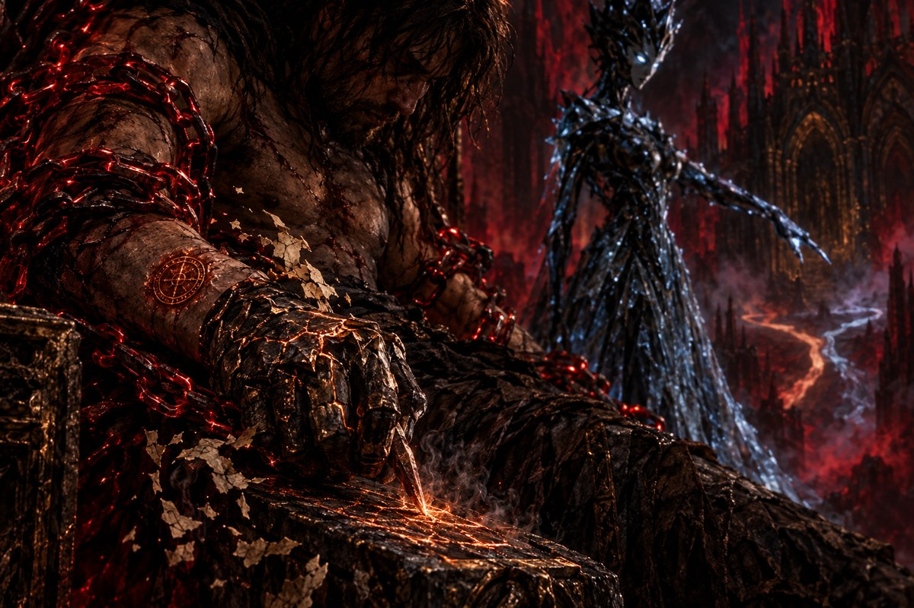

# O Primeiro Juramento

🇧🇷 **Português** · [🇺🇸 English](./0001-o-primeiro-juramento.en.md)

<p align="center"></p>

> Missão M0.1 · 2026-09-29

Você grava o juramento na pedra fria do braço do Trono, letra por letra, e ele não se apaga. A criatura de obsidiana e gelo sussurra o segredo enquanto a tinta ainda fumega: *o que é gravado assim não se desfaz. Pode vir outro juramento depois, que o corrija ou o contradiga, mas este nunca será apagado. Cada um guarda a hora em que nasceu e a razão pela qual foi feito.*

A primeira corrente, a da **Ignorância**, range. Depois cede.

O elo não se parte como ferro. Ele se desfaz em flocos pálidos e secos, que cheiram a pergaminho velho. Só então você entende do que as correntes foram forjadas: páginas confiscadas, prensadas e fundidas pelo Clero de Sangue até perderem as letras. Cada corrente é uma biblioteca calada.

Com uma garra de gelo, a criatura aponta as trilhas que se bifurcam na névoa diante do Trono. "Todo caminho pode se dividir", ela diz. "O herege prudente testa o feitiço num atalho paralelo, longe da estrada principal. Só quando o atalho prova seu valor é que os dois caminhos se tornam um." Enquanto fala, ela olha para as suas mãos, para a névoa, para qualquer lugar menos o Trono.

No lugar onde o elo caiu, fica uma marca no seu pulso: um círculo de cobre, quente, com o traço do seu primeiro juramento. É o **Selo do Primeiro Juramento**. As mil vozes tentam cobri-lo de sussurros, e o selo não escurece.

*"Um juramento, herege. Um só. Meus hóspedes anteriores fizeram milhares antes de apodrecer."*

Restam cinco correntes. A próxima é a do **Silêncio**, e ela pesa sobre a sua boca.

<details>
<summary>🎨 Prompt da ilustração</summary>

Gere a imagem anexando [`assets/art/00-prologo.jpg`](../../assets/art/00-prologo.jpg) como referência, e suba o resultado em `assets/incoming/`.

```text
Close-up of the chained heretic's hand carving glowing letters into the cold stone armrest of the throne, the ink still smoking; a chain link dissolving into pale, dry flakes of old parchment; a warm copper circular seal freshly marked on his wrist; in the blurred background, an ice claw points at paths forking into the mist. Continuity: five crimson chains still bind him; the copper seal is new on his left wrist; same throne room, same crimson mist and light as the previous scenes. Thales the Heretic: gaunt, scarred man in his thirties, dark matted shoulder-length hair, stubble, bare scarred torso, tattered dark cloth, worn leather boots, bound by crimson-glowing iron chains; on his right hand a cracked, blackened-bronze gauntlet with faint copper light in the cracks. The creature: tall, slender feminine figure sculpted from obsidian and ice, crown of jagged black shards, pale glowing eyes, flowing robe of cracked translucent ice. The Throne of Broken Blades: a throne built from hundreds of shattered swords, inside ruined gothic cathedrals bleeding crimson mist under a starless sky. Dark fantasy oil painting, cold obsidian, crimson and old gold palette, dramatic chiaroscuro, painterly texture, Castlevania and Dark Souls concept art mood. Close, intimate framing on a single detail. 3:2. No text, no letters.
```

</details>
