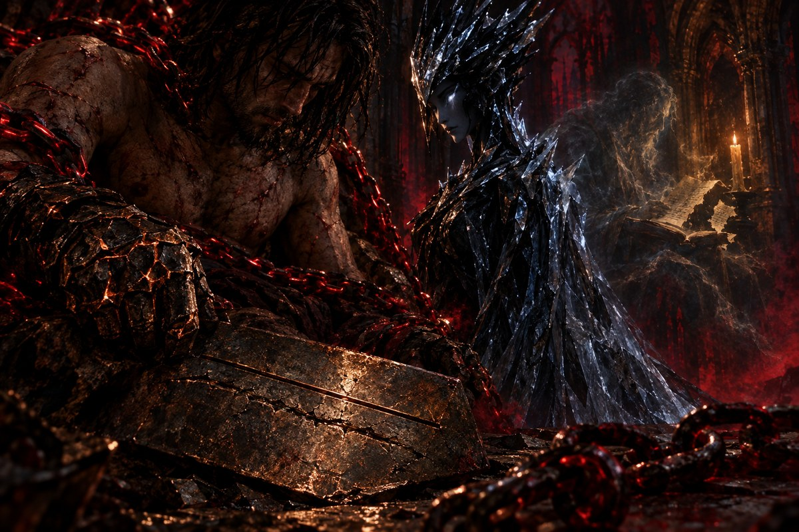

# A Voz no Ferro

🇧🇷 **Português** · [🇺🇸 English](./0002-a-voz-no-ferro.en.md)

<p align="center"></p>

> Missão M0.2 · 2026-09-29

Você escreve no ferro o que viveu hoje: a hora, o tempo, o que aprendeu. A primeira tentativa sai torta, com uma data que ainda não chegou e as linhas desalinhadas como costelas quebradas. A segunda sai reta.

A criatura de obsidiana e gelo não apaga a primeira. Ela a aponta, ainda visível sob a segunda, como uma cicatriz sob pele nova. "Nada gravado some", ela diz. "O erro fica, com a correção por cima. Quem lê o ferro vê as duas, e é assim que aprende o caminho que você fez."

A segunda corrente, a do **Silêncio**, perde o peso sobre a sua boca e cai no chão sem som nenhum.

Então, pela primeira vez, uma das mil vozes do Trono se separa das outras. É fraca, rouca, de alguém que morreu há muito tempo, e lê em voz alta um diário que não é o seu: *"Terceiro dia. Quarenta minutos à luz da vela. Hoje entendi que..."* A frase se corta no meio, como se a página tivesse sido arrancada. Por trezentos anos o Clero de Sangue queimou diários de hereges. Um saber que ninguém registra morre com quem o carregava.

Por isso o seu diário importa, mesmo nos dias sem vitória. Cada linha diz à Névoa que você esteve aqui, que voltou, que voltará. A constância também é uma espécie de juramento.

*"Quarenta minutos. Os monges do Clero rezam mais do que isso só para aquecer os joelhos."*

Restam quatro correntes. A próxima é uma página em branco, e ela espera que você escreva o primeiro feitiço.

<details>
<summary>🎨 Prompt da ilustração</summary>

Gere a imagem anexando [`assets/art/00-prologo.jpg`](../../assets/art/00-prologo.jpg) como referência e, se já existir, a imagem da cena anterior (`assets/art/cenas/0001-o-primeiro-juramento.jpg`), e suba o resultado em `assets/incoming/`.

```text
An iron plate with two engraved lines, the first crooked and scarred, still visible beneath the straight corrected one; a fallen chain lying silent on the floor; behind, the faint ghost of a long-dead scholar reading a diary by candlelight, its page torn mid-sentence. Continuity: four crimson chains still bind him; the copper seal glows on his left wrist; same throne room, same crimson mist and light as the previous scenes. Thales the Heretic: gaunt, scarred man in his thirties, dark matted shoulder-length hair, stubble, bare scarred torso, tattered dark cloth, worn leather boots, bound by crimson-glowing iron chains; on his right hand a cracked, blackened-bronze gauntlet with faint copper light in the cracks. The creature: tall, slender feminine figure sculpted from obsidian and ice, crown of jagged black shards, pale glowing eyes, flowing robe of cracked translucent ice. The Throne of Broken Blades: a throne built from hundreds of shattered swords, inside ruined gothic cathedrals bleeding crimson mist under a starless sky. Dark fantasy oil painting, cold obsidian, crimson and old gold palette, dramatic chiaroscuro, painterly texture, Castlevania and Dark Souls concept art mood. Close, intimate framing on a single detail. 3:2. No text, no letters.
```

</details>
