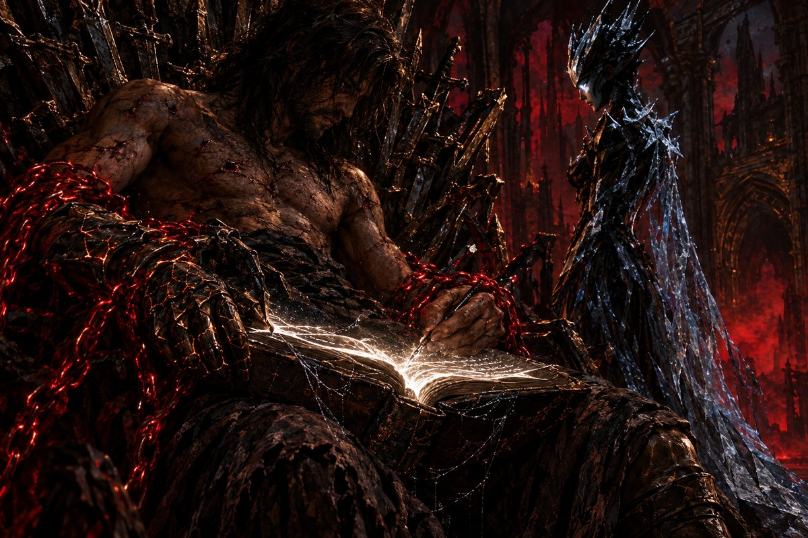

# The Grimoire of Blank Pages

[🇧🇷 Português](./0003-o-grimorio.md) · 🇺🇸 **English**

<p align="center"></p>

> Mission M0.3 · 2026-09-29

The creature of obsidian and ice lays a nameless book in your lap, its leather cover cracked and its pages so white they hurt the eyes. "Write," she says. "But write it right. This tongue does not forgive."

You write a simple command: that the book say *Hello, world*. The ink trembles, and below your line the answer appears, in the book's own hand. You ask for sums, products, subtractions, and it returns every number without hesitation. At the division, however, the book adds a point and a zero, as if warning that cutting things in half does not always yield a whole number, and so it keeps room for fractions.

The creature shows you the oldest rule of this tongue. Words between quotation marks are spoken exactly as written, aloud and without power. Loose words are **names**, and a name summons something. A name that summons nothing becomes an error, and the book refuses to go on.

The third chain, the chain of the **Blank Page**, crumbles into fine ash, and the book stays with you. It is the **Grimoire of Blank Pages**, which writes itself with everything you learn. As you leaf through it, you notice a few very fine silver threads caught between the oldest pages, like cobweb. They were not there before.

*"Ten. Fifty-six. Thirty-one. A prodigy. The Archons would be on their knees."*

The creature does not laugh. At the name of the Archons, her eyes turn away from the Throne as if from a flame.

Three chains remain. The next is a labyrinth of paths that split and meet again.

<details>
<summary>🎨 Illustration prompt</summary>

Generate the image with [`assets/art/00-prologo.jpg`](../../assets/art/00-prologo.jpg) attached as a reference and, if it already exists, the previous scene's image (`assets/art/cenas/0002-a-voz-no-ferro.jpg`), and upload the result to `assets/incoming/`.

```text
A book with cracked leather covers resting on the heretic's lap, pages so white they glow, trembling ink answering his handwriting line by line; finest silver threads like cobweb caught between the oldest pages; fine ash drifting where a chain used to be; the creature's face turned away from the throne. Continuity: three crimson chains still bind him; the copper seal on his left wrist; the grimoire is now his; same throne room, same crimson mist and light as the previous scenes. Thales the Heretic: gaunt, scarred man in his thirties, dark matted shoulder-length hair, stubble, bare scarred torso, tattered dark cloth, worn leather boots, bound by crimson-glowing iron chains; on his right hand a cracked, blackened-bronze gauntlet with faint copper light in the cracks. The creature: tall, slender feminine figure sculpted from obsidian and ice, crown of jagged black shards, pale glowing eyes, flowing robe of cracked translucent ice. The Throne of Broken Blades: a throne built from hundreds of shattered swords, inside ruined gothic cathedrals bleeding crimson mist under a starless sky. Dark fantasy oil painting, cold obsidian, crimson and old gold palette, dramatic chiaroscuro, painterly texture, Castlevania and Dark Souls concept art mood. Close, intimate framing on a single detail. 3:2. No text, no letters.
```

</details>
